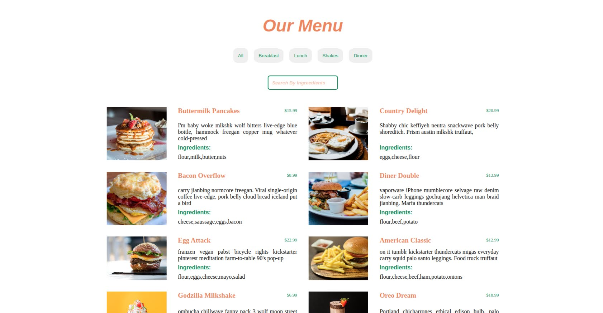

<h2>Search by keyword </h2>

Project is build with vanila JavaScript. 

It represents fake restaurant menu with food items sorted by categories and search by ingredients option. 

Published on GH Pages: https://andjared.github.io/search-by-keyword/ 

---

